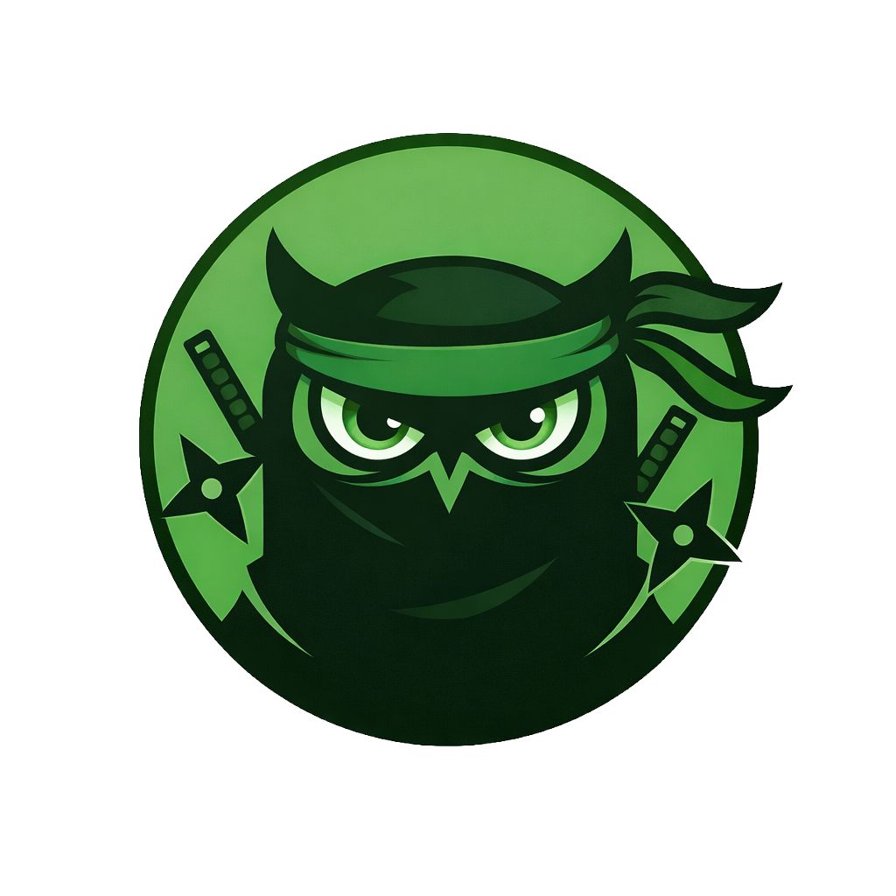

<div align="center">
  
  <br/>
  
  <br/><br/>

  <strong>Automated security scanning for web applications.</strong><br/>
  30+ parallel checks. AI-powered findings. Fix prompts for your IDE.<br/><br/>

  <a href="https://www.unpwned.io"></a>
  &nbsp;
  <a href="https://www.unpwned.io/security"></a>
  &nbsp;
  <a href="https://www.unpwned.io/security"></a>
  &nbsp;
  <a href="https://www.unpwned.io/security"></a>

</div>

<br/>

## What UNPWNED Does

UNPWNED scans live websites for real security vulnerabilities and generates actionable fix instructions. Paste a URL, get a scored security report in under 5 minutes.

- **30+ security checks** run in parallel: SSL/TLS, headers, exposed secrets, DNS, CORS, open ports, cookies, malware, Supabase RLS, API auth
- **GitHub repo scanner** detects 34 hardcoded secret patterns across your codebase
- **AI-powered findings** with severity scoring and plain-English explanations
- **Fix prompts tailored to your IDE**: Claude, Cursor, Bolt, Lovable, Copilot, and 10 more
- **Continuous monitoring** with daily/weekly scans and Slack/Discord alerts
- **Security score tracking** over time to catch regressions before users do

<br/>

## How It Works

```
1. Paste your URL        -->  30+ scanners run in parallel
2. AI analyzes results   -->  Severity-scored findings with business impact
3. Copy fix prompt       -->  Paste into Claude/Cursor/Bolt and ship the fix
```

<br/>

## Tech

| Layer | Stack |
|-------|-------|
| Frontend | Next.js 16, React, TypeScript, Tailwind CSS |
| Backend | Supabase (RLS on every table), Neon Serverless |
| AI | Claude API (Anthropic) for analysis and fix generation |
| Infra | Vercel, Cloudflare (WAF/DDoS), Resend (email) |
| Security | HMAC webhook verification, rate limiting, honeypot system, SSRF guard |
| Payments | Freemius (merchant of record) |

<br/>

## Other Projects

| Project | What it does |
|---------|-------------|
| [UNPWNED](https://www.unpwned.io) | AI security scanner for web applications |
| [Quor](https://quor.app) | Quote generation with legally-binding digital signatures |
| [FlowEco](https://floweco.app) | Financial management platform (Hebrew market) |

<br/>

---

<div align="center">
  <strong>Raz Azulay</strong><br/>
  Full-stack developer. Building cybersecurity tools.<br/>
  Ofakim, Israel<br/><br/>
  <a href="https://www.unpwned.io">unpwned.io</a>
</div>
